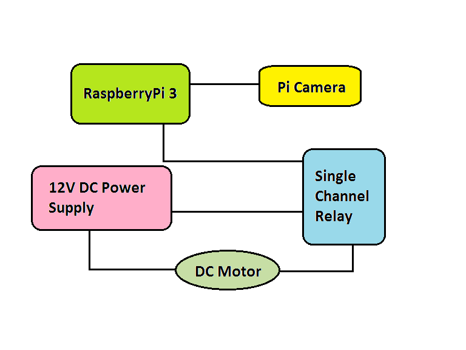

# Safety Enforcing Object Detection System - An intelligent system for detection of a helmet

### Introduction
Intelligent System for Helmet Detection using Raspberry Pi ensures helmet possession by a motorcyclist at all times by capturing a snapshot of the rider’s helmet using Pi Camera and confirming object detection by Haar cascading technique. The main idea behind the project is to reduce road fatalities among motorcyclists. Due to ignorance of riders for the Helmet compulsion law, every motorcyclist's safety has been compromised. Intelligent System for Helmet Detection solves this problem by leaving the rider no choice as the engine of the vehicle is operated through a single channel relay which is only closed after detection of the rider's helmet.

### Basic Concept

To make use of the Open computer vision library to process the buffered images captured through a raspberry pi camera module and highlight the detected object with a rectangle. After this process the python script will decide whether or not to provide access to the motorcyclist.

### Problem Overview

Two-wheelers, the mode of transport most Indians use, continue to be the most vulnerable to accidents. Indian roads were at their deadliest in 2015 claiming more than 16 lives every hour on average. Over 1.41 lakh people died in crashes, 3% more than the number of fatalities in 2014. Accidents involving two-wheelers and accounted for nearly half of the lives lost in road crashes. While 13,787 two-wheeler drivers were killed in crashes, 23,529 other people were killed in accidents involving these vehicles, while close to 1.4 lakh people were left injured in them.

The top five states - Uttar Pradesh, Tamil Nadu, Maharashtra, Karnataka and Rajasthan - accounted for over 40% of the fatalities. Among 53 mega cities, Delhi registered the highest number of fatalities at 2,199 and Maharashtra recorded 1,046 such deaths. Bhopal and Jaipur ranked third and fourth with the city roads claiming 1,015 and 844 lives respectively.Protective smart gear to increase road safety among motorcyclists. The idea is obtained after observing that there are nearly 2500 motorcycle accidents per day in Maharashtra itself.

With the use of image processing unit in Raspberry pi, the motorcycle can only be started if the rider possesses the helmet. A magnetic relay is attached to the raspberry pi circuit which detects if the standard symbol is identified or not. Since two wheelers are the most used transport means in India, this project has a wide application in the field of transport and vehicle management. Speeding and not wearing a helmet are the two most common reasons behind motorcycle fatalities. This project will increase rider safety and increase chance of life even though an accident occurs.

### System Architecture

### Results

